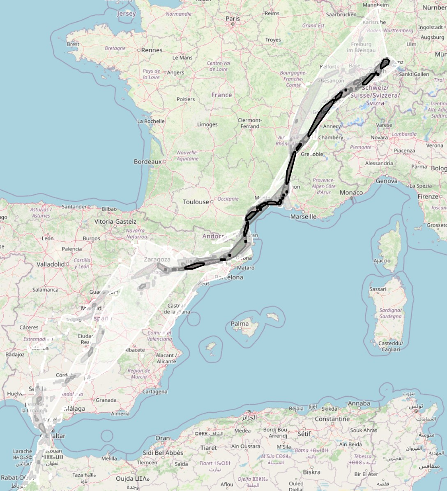
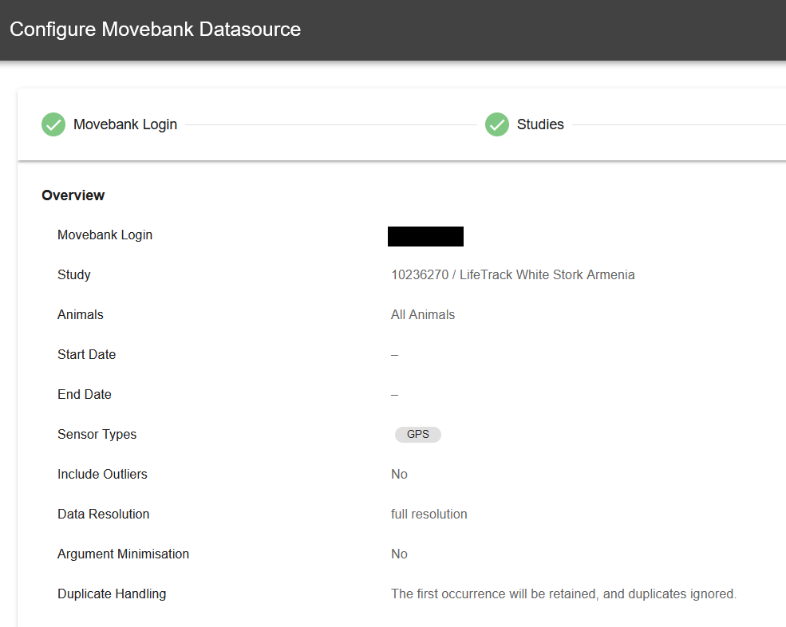
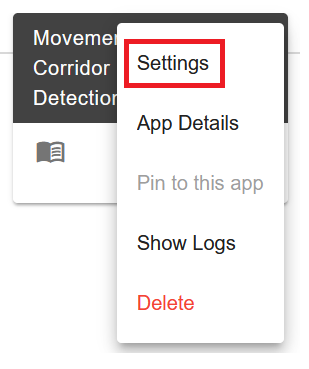
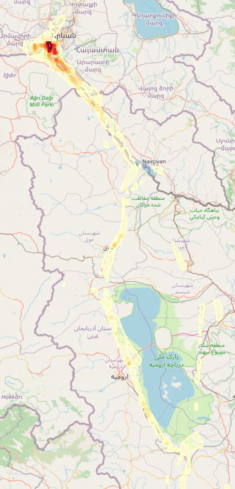

# Movement Corridor Detection

MoveApps

Github repository: https://github.com/chei90/EMAC_Corridors

## Description

This app is about detecting corridors of animal movement. The current output of this app is a html file (containing a map, can be opened with browser) that highlights areas where more individuals have traversed through. The darker the color, the more individuals were recorded.

### EuroDeer Roe deer in Italy 2005-2008

### North Sea population tracks of greater white-fronted geese 2014-2017 (data from Klzsch et al. 2019)

### LifeTrack White Stork SW Germany

## Documentation

1. The input data is stripped from all unwanted data. Only the individual id, the timestamp and position are kept.
2. The trajectories are simplified by using [Ramer-Douglas-Peucker-Algorithm](https://en.wikipedia.org/wiki/Ramer%E2%80%93Douglas%E2%80%93Peucker_algorithm). The magnitude of simplification can be controlled via the *Rdp Epsilon* parameter. As described in the Settings section.
3. The trajectories are traced against a grid
4. The number of different individuals per grid is counted
5. Adjacent cells (moore neighbourhood) are joined, the MCP is calculated.
6. The sum of mcps is simplified and returned.

### Input data

The app expects a TrajectoryCollection whose GeoDataFrames contain the following columns: 

* **timestamps** - column containing the time when the data point was recorded
* **individual.local.identifier** - column containing the distinct individual id
* **geometry** - point geometry (lon, lat), the gps/surface position where the data was recorded

### Output data
This app produces multiple polygons that denote the different passage corridors. Since TrajectoryCollection doesn't support polygons, the data has to be provided as artifact (downloadable content). See below. 

In consequence: the output data of this app is not intended to be processed further. The app outputs the input data.

### Artifacts

* **corridors_map.html** - Can be opened with the browser. Contains an OpenStreetmap with the computation results as overlays. 
* **Shapefile** - Verified compatible with QGis and Arcgis. 

### Settings 
All settings values are positive integers, so negative values are not allowed.

* **Rdp Epsilon** - The Ramer-Douglas-Peucker-Algorithm is used to reduce the trajectories point count, hence improving the computation time. Greater values will reduce the point count per trajectory, smaller values will preserve more points. Think of it like, remove every point from the trajectory that is closer to a given start/end segment than N meters.
* **Grid resolution** - The resolution of the raster (in meters) that is used to bin different individuals traversing map segments. Smaller values will make the result more fine grained, but will probably reduce the avg amount of captured individuals per raster cell (as it's smaller now). Result of very small values (e.g. 50 meters) will look mostly like the input trajectories. Reducing the grid size will increase computation time.
* **Graduation white** - The minimum number of captured individuals per grid cell to appear as white polygon on the map. Grid cells with an individual count lower than this number will not appear. This value has to be lower than, or equal to the graduation light gray value. 
* **Graduation light gray** - The minimum number of captured individuals per grid cell to appear as light gray polygon on the map. Grid cells with an individual count lower than this number fall in the previous graduation. This value has to be lower than, or equal to the graduation gray value and larger than or equal to the graduation white value.
* **Graduation gray** - The minimum number of captured individuals per grid cell to appear as gray polygon on the map. Grid cells with an individual count lower than this number fall in the previous graduation. This value has to be lower than, or equal to the graduation dark gray value and larger than or equal to the graduation light gray value.
* **Graduation dark gray** - The minimum number of captured individuals per grid cell to appear as dark gray polygon on the map. Grid cells with an individual count lower than this number fall in the previous graduation. This value has to be lower than, or equal to the graduation black value and larger than or equal to the graduation gray value.
* **Graduation black** - The minimum number of captured individuals per grid cell to appear as black polygon on the map. Grid cells with an individual count lower than this number fall in the previous graduation. This value has to be larger than or equal to the graduation dark gray value.

### Null or error handling

If the graduation criteria is not met, an Exception will be thrown:
> GraduationWhite <= GraduationLightGray <= GraduationGray <= GraduationDarkGray <= GraduationBlack

## Working Example

This section is intended to give you a good basis on where to start to check out the app. Create a new workflow:

If you want to start by reproducing my results, choose the following movebank dataset as datasource:

**Note** Don't forget to use the translator app that converts R dataframes to pythons' Trajectorycollection (see in the workflow above: *moveStack to MovingPandas*).

Open the App Settings of *Movement Corridor Detection*:

Set the settings to:

* Rdp Epsilon: 350
* Grid resolution: 2000
* Graduation white: 2
* Graduation light gray: 3
* Graduation gray: 4
* Graduation dark gray: 6
* Graduation black: 8

You will get the following result

### Discussing the result

According to the settings, white areas denote that two individuals passaged through this area. Black areas on the other hand denote areas where at least 8 individuals where recorded. 

One has to adjust the graduation parameters according to their data. E.g. if your dataset contains only four individuals, a graduation of this would be adequate:

* Graduation white: 1
* Graduation light gray: 2
* Graduation gray: 2
* Graduation dark gray: 3
* Graduation black: 3

Resulting in the colors white, gray and black appearing on the map (light gray and dark gray would be skipped).

On the other hand, if your dataset contains 20 individuals, the graduation could look like this:

* Graduation white: 4
* Graduation light gray: 7
* Graduation gray: 10
* Graduation dark gray: 13
* Graduation black: 16

*Graduation white: 4* will result in all raster cells that contain less than four passage records of individuals will be discarded.

**Note:** Increasing the *Grid resolution* will result in more individuals being recorded per grid cell (as the cells are bigger and have a greater chance that more distinct individuals will pass through them). So in this case you may want to also increase the graduation values. This holds true in the other direction, too. If you reduce the grid size, fewer individuals will (probably) be captured per cell, hence reducing the graduation intervals might be a good idea.